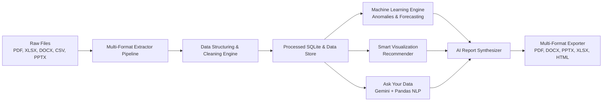

<div align="center">

# ⚡ DataMorph AI

### Transform Any Raw File into Structured Data, Visual Insights & Executive Reports

[](https://www.python.org/)
[](https://fastapi.tiangolo.com/)
[](https://react.dev/)
[](https://www.typescriptlang.org/)
[](https://tailwindcss.com/)
[](LICENSE)

<p align="center">
  <b>DataMorph AI</b> is an intelligent data transformation workspace that converts messy, unstructured files (PDFs, presentations, spreadsheets, documents, text logs) into clean tabular data, automated machine learning insights, interactive charts, and C-level executive reports in seconds.
</p>

[Key Features](#-key-features) • [Architecture](#-architecture--workflow) • [Tech Stack](#-technology-stack) • [Quick Start](#-quick-start) • [API Overview](#-api-endpoints)

---

</div>

## 🌟 What Problem Does DataMorph AI Solve?

In enterprise environments, over **80% of data is trapped in unstructured or dirty formats**:
- Scanned quarterly PDF reports with uncopyable tables
- Messy Excel/CSV spreadsheets with mixed date formats, irregular currencies, and duplicate rows
- Meeting notes, Word docs, and PowerPoint decks with isolated metrics

**DataMorph AI** automates this entire pipeline. Upload any file, let AI parse and clean the data, query it in plain English, discover anomalies and forecast trends, and export publication-ready reports in multiple formats.

---

## 🚀 Key Features

<table>
  <tr>
    <td width="50%">
      <h3>📄 Multi-Format Intelligent Extraction</h3>
      Seamlessly ingest and extract tabular, matrix, and semantic contents from:
      <ul>
        <li><b>PDF</b> (tables, visual structures, text blocks via PyMuPDF & pdfplumber)</li>
        <li><b>Spreadsheets</b> (Excel <code>.xlsx</code>/<code>.xls</code> multi-sheet, <code>.csv</code>)</li>
        <li><b>Documents & Slides</b> (Word <code>.docx</code>, PowerPoint <code>.pptx</code>)</li>
        <li><b>Semi-Structured / Plain Text</b> (<code>.json</code>, <code>.xml</code>, <code>.txt</code>, logs)</li>
      </ul>
    </td>
    <td width="50%">
      <h3>🧼 AI Data Structuring & Cleaning</h3>
      Interactive data preparation with live Before vs. After previews:
      <ul>
        <li>Auto-deduplication & missing value imputation (median/mode)</li>
        <li>Smart currency normalization (handles <code>$</code>, <code>₹</code>, <code>€</code>, accounting parentheses)</li>
        <li>Date harmonization to ISO 8601</li>
        <li>Fuzzy category unification (e.g. <code>iphone</code>, <code>iPhone</code>, <code>IPHONE</code> &rarr; <code>iPhone</code>)</li>
        <li>Live Data Quality Health Score (e.g., 68% &rarr; 95%)</li>
      </ul>
    </td>
  </tr>
  <tr>
    <td width="50%">
      <h3>🤖 Machine Learning & Predictive Analytics</h3>
      Statistical rigor built directly into your workflow:
      <ul>
        <li><b>Anomaly Detection</b>: Multivariate outlier isolation via Scikit-Learn <code>IsolationForest</code> with severity grading.</li>
        <li><b>Time-Series Forecasting</b>: Polynomial & Ridge trend projections with 95% confidence intervals.</li>
        <li><b>Correlation Discovery</b>: Multi-feature correlation matrix and relationship highlights.</li>
      </ul>
    </td>
    <td width="50%">
      <h3>💬 Conversational "Ask Your Data"</h3>
      Talk to your files in plain English:
      <ul>
        <li>Natural language query interface powered by Gemini LLM & Pandas.</li>
        <li>Returns instant factual answers backed by data citations.</li>
        <li>Generates supporting data slices and dynamic visual chart suggestions automatically.</li>
      </ul>
    </td>
  </tr>
  <tr>
    <td width="50%">
      <h3>📊 Smart Visualization Studio</h3>
      Automatic chart recommendations based on data topology:
      <ul>
        <li>High-confidence recommendations for Line, Bar, Donut/Pie, Scatter, Area, and Radar charts.</li>
        <li>Custom visualization builder with real-time axis mapping and aggregations.</li>
        <li>Interactive charts rendered with Recharts and smooth animations.</li>
      </ul>
    </td>
    <td width="50%">
      <h3>📑 AI Report Builder & Multi-Format Export</h3>
      Executive reporting ready for stakeholders:
      <ul>
        <li>Auto-generates Title Page, Executive Summary, Dataset Overview, Anomaly Highlights, and Strategic Recommendations.</li>
        <li>5 professional themes: <i>Corporate, Minimal, Modern, Professional, Research</i>.</li>
        <li>1-Click export to <b>PDF, Word (.docx), PowerPoint (.pptx), Excel (.xlsx), and responsive HTML</b>.</li>
      </ul>
    </td>
  </tr>
</table>

---

## 🛠️ Technology Stack

DataMorph AI is built using modern, production-grade tools across the frontend, backend, and machine learning layers:

### Frontend
- **Framework**: [React 19](https://react.dev/) + [Vite](https://vitejs.dev/) + [TypeScript](https://www.typescriptlang.org/)
- **Styling & UI**: [Tailwind CSS](https://tailwindcss.com/), Glassmorphism design tokens, CSS micro-animations
- **Charts & Visualizations**: [Recharts](https://recharts.org/)
- **Animations & Icons**: [Framer Motion](https://www.framer.com/motion/), [Lucide React](https://lucide.dev/), Canvas Confetti
- **HTTP Client**: [Axios](https://axios-http.com/)

### Backend
- **Framework**: [FastAPI](https://fastapi.tiangolo.com/) (Asynchronous Python Web Framework)
- **Server**: [Uvicorn](https://www.uvicorn.org/) (ASGI server)
- **Database / ORM**: [SQLAlchemy 2.0](https://www.sqlalchemy.org/) with asynchronous SQLite (`aiosqlite`)
- **Data Validation & Settings**: [Pydantic v2](https://docs.pydantic.dev/) & Pydantic-Settings

### Machine Learning & Processing Engines
- **Data Wrangling**: [Pandas](https://pandas.pydata.org/), [NumPy](https://numpy.org/)
- **Machine Learning**: [Scikit-Learn](https://scikit-learn.org/) (Isolation Forest, Trend & Ridge Regressors)
- **LLM & GenAI**: [Google Gemini GenAI SDK](https://ai.google.dev/) (`google-genai`)
- **Document Extractors**: PyMuPDF (`fitz`), `pdfplumber`, `python-docx`, `python-pptx`, `openpyxl`, `xmltodict`
- **Document Exporters**: ReportLab (Vector PDF Generation), `python-docx`, `python-pptx`, `openpyxl`

---

## 🏛️ Architecture & Workflow



---

## ⚡ Quick Start

### Prerequisites
- **Python 3.10+**
- **Node.js 18+** & **npm**

### 1. Clone Repository
```bash
git clone https://github.com/vitesh9876/DataMorph-AI.git
cd DataMorph-AI
```

### 2. Set Up Backend
```bash
cd backend

# Create virtual environment
python -m venv venv
# Windows:
.\venv\Scripts\activate
# macOS/Linux:
# source venv/bin/activate

# Install dependencies
pip install -r requirements.txt

# (Optional) Add your Gemini API Key
cp .env.example .env
# Edit .env and set GEMINI_API_KEY="your-api-key"

# Start backend server
python -m uvicorn app.main:app --reload --port 8000
```
Backend API will be running at `http://localhost:8000`.
- Interactive Swagger API Documentation: `http://localhost:8000/docs`
- ReDoc Documentation: `http://localhost:8000/redoc`

### 3. Set Up Frontend
Open a new terminal window:
```bash
cd frontend

# Install dependencies
npm install

# Start Vite dev server
npm run dev
```
Open your browser at `http://localhost:5173` to explore the DataMorph AI application!

---

## 📡 API Endpoints

| Category | Endpoint | Method | Description |
| :--- | :--- | :---: | :--- |
| **Ingestion** | `/api/v1/upload` | `POST` | Upload file & launch async processing pipeline |
| **Pipeline** | `/api/v1/upload/{file_id}/status` | `GET` | Track multi-stage pipeline processing status |
| **Analysis** | `/api/v1/analysis/{file_id}` | `GET` | Retrieve document metrics, entity cards, & quality score |
| **Structuring** | `/api/v1/structuring/{file_id}` | `GET` | Side-by-side Raw vs Clean preview with recommendations |
| **Structuring** | `/api/v1/structuring/{file_id}/rules/action` | `POST` | Accept or reject specific cleaning rules |
| **Visuals** | `/api/v1/visualizations/{file_id}` | `GET` | Get AI recommended charts with confidence scores |
| **Visuals** | `/api/v1/visualizations/{file_id}/custom` | `POST` | Generate ad-hoc custom charts |
| **Ask Data** | `/api/v1/ask-data/{file_id}` | `POST` | Ask questions in plain English & receive chart + data answer |
| **ML** | `/api/v1/ml/{file_id}/anomalies` | `GET` | IsolationForest outlier detection & explanations |
| **ML** | `/api/v1/ml/{file_id}/forecast` | `POST` | Trend & future value projection |
| **Reports** | `/api/v1/reports/generate` | `POST` | Synthesize complete structured executive report |
| **Export** | `/api/v1/export` | `POST` | Export to PDF, Word, PowerPoint, Excel, or HTML |

---

## 🧪 Testing

The backend includes a comprehensive suite of unit and integration tests:

```bash
cd backend
python -m pytest tests/ -v
```
Or run the all-in-one verification suite:
```bash
python run_all_tests.py
```

---

## 📄 License

This project is licensed under the MIT License - see the [LICENSE](LICENSE) file for details.
